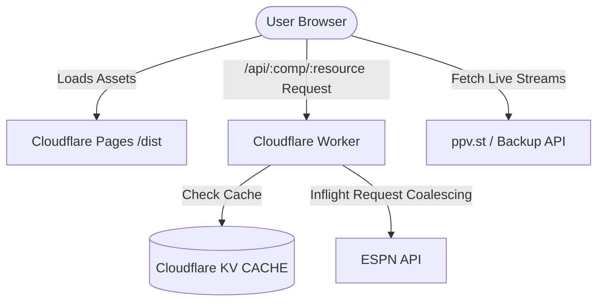

# Repository Guidelines

## Project Overview
StreamCup is a high-performance, lightweight web application for tracking sports event schedules, standings, statistics, and live streams (supporting FIFA World Cup, Premier League, NBA, etc.). It consists of a React-based Single Page Application (SPA) on the frontend and a Cloudflare Workers proxy on the backend to cache and coalesce ESPN API requests.

## Architecture & Data Flow

* **Frontend SPA**: React 18 application built with Vite and Tailwind CSS. It features a hand-rolled History API router (`src/utils/router.ts`), custom Contexts for state/theme/i18n, and custom hooks with page-visibility-aware background polling (every 30s for matches, 60s for streams).
* **SportAdapter System**: Located in `src/adapters/`. An abstract `SportAdapter` interface (`types.ts`) is implemented by `soccer` and `basketball` adapters to normalize raw ESPN API responses into standard frontend structures (`CompMatch[]`, `StandingsData`, `MatchDetail`).
* **Backend Edge Proxy**: Cloudflare Worker (`worker/index.ts`) serving `/api/:comp/*` requests. It validates parameters, caches raw data in Cloudflare KV using a Stale-While-Revalidate (SWR) strategy, and coalesces concurrent requests in memory to minimize upstream load.

## Key Directories
* `src/adapters/`: Sports normalization layer containing `soccer.ts`, `basketball.ts`, and interface `types.ts`.
* `src/components/`: Modular React components. Subfolders include `matchdetail/` for tabbed subviews.
* `src/hooks/`: Data hooks (`useCompetition`, `useMatchDetail`, `useStreams`) managing polling, SWR caching, and request aborting.
* `src/utils/`: Pure utilities (e.g. `router.ts` for routing, `calendar.ts` for `.ics`/Google Calendar, `streamSources.ts` for trusted hosts, `espn.ts` for soccer 2D tactical coordinate mapping).
* `worker/`: Cloudflare Worker entrypoint and its Vitest unit tests.
* `docs/`: Superpower spec documents and development implementation plans.

## Development Commands
* `bun run dev`: Start local Vite development server on port 5173 (with local API proxy rules).
* `bun run build`: Run frontend and worker typechecks followed by static assets build via Vite.
* `bun run test`: Run the Vitest test suite.
* `bun run typecheck`: Run TypeScript compilation check for both React app and Worker code.
* `bun run lint`: Run Biome linter.
* `bun run format`: Run Biome formatter auto-write.

## Code Conventions & Common Patterns
### 1. Rounded Glassmorphism Design
Layout panels, cards, and modal components match Apple Sports style.
* **Standard Card (`.ds-glass`)**: `rounded-card border border-line/30 bg-panel/85 shadow-panel backdrop-blur-md`
* **Hero Panel (`.ds-glass-hero`)**: `rounded-panel md:rounded-hero border border-line/30 bg-gradient-to-b from-panel/95 to-panel/85 shadow-hero backdrop-blur-md`
* **Corner Radius Family**: Proportional rounded corners derived from the base panel radius (`--r-panel` / 24px):
  * `rounded-micro` (3px) for micro elements/flags.
  * `rounded-sm` / `rounded-card` / `rounded-panel` / `rounded-hero` (all 24px) for layouts.
  * `rounded-pill` (9999px) for capsule controls/buttons.

### 2. Capsule Controls
Tab lists, page navigation, and selectors must use capsule-shaped Segmented Controls:
* **Segmented Track**: `flex items-center gap-1 p-1 rounded-pill bg-panel/60 border border-line/20`
* **Segmented Tab**: `px-3.5 py-1 rounded-pill font-display text-sm text-chalkdim hover:text-chalk transition-all`
  * **Active state**: `bg-overlay/10 text-chalk font-bold shadow-sm`

### 3. Design Tokens & Styling
* Theme tokens are defined in `design-tokens/tokens.json` and mapped to Tailwind/CSS variables.
* Core palette includes: `night` (bg), `panel` (surface), `panel2` (header/table rows), `line` (borders), `chalk` (primary text), `chalkdim` (muted text), `pitch` (accent green), `live` (badge red), `amber` (half-time yellow), `overlay` (contrast accent).
* Font variables: `--font-display` (Saira Condensed) for scores/tables, `--font-body` (Hanken Grotesk) for general text, `--font-mono` (ui-monospace) for timer/scores to avoid layout shifts.

### 4. Code & Async Patterns
* **Async Safety**: Every async fetch inside an effect hook MUST listen to an `AbortSignal` via `AbortController` to cancel pending fetches on component unmount or state re-fetch.
* **State Management**: State is local, passed down, or managed using React Context (e.g. `LanguageProvider`, `ThemeProvider`). Collections are synchronized across tabs using the `storage` event listener on `localStorage`.
* **Safe Routing**: Path decoding parameters (slug, teamId, athleteId) must be wrapped in `safeDecode` to prevent `URIError` crash from malicious URI payloads.
* **Native Elements**: Prefer native HTML components where possible (e.g. using `
` and `
` for dropdown reminder/calendar menus).

## Important Files
* `src/main.tsx`: Frontend entrypoint, Context providers configuration, and Service Worker registration.
* `src/App.tsx`: Root component and main router distribution hub.
* `src/competitions.ts`: Master configuration for competitions. Implements `seasonForDate` (October-based flip for basketball/season-shape, August-based for soccer/split-shape) and `buildUrl`.
* `src/utils/router.ts`: Hand-rolled HTML5 History API router. Custom event `'app:routechange'` notifies hooks of programmatic navigation.
* `src/utils/calendar.ts`: Calendar helper. Generates Google Calendar URLs and system-level `.ics` URIs (escapes special characters to prevent format breakage).
* `worker/index.ts`: Edge Worker executing KV SWR caching, request coalescing, and automatic fetch retry fallback.
* `public/sw.js`: Service worker implementing cache-first for hashed assets and network-first for index.html.

## Runtime/Tooling Preferences
* **Runtime**: **Bun** is the preferred local environment (lockfile: `bun.lock`).
* **Package Manager**: **Bun** (`bun install`, `bun test`, `bun run`).
* **Tooling Constraints**: **Biome** (v2.5.1) handles linting and formatting. Do not use Prettier or ESLint. Code styling conforms strictly to `biome.json`.
* **TypeScript Configurations**: Split into `tsconfig.json` (frontend React, includes `DOM` library) and `tsconfig.worker.json` (backend Cloudflare Worker, excludes `DOM` library to prevent invalid web API references in workerd V8 context).

## Testing & QA
* **Framework**: **Vitest** (v1.6.1) is the test runner.
* **Testing Environments**:
  * Frontend components (`src/**/*.test.tsx`, `src/**/*.test.ts`) run in a **JSDOM** environment.
  * Worker tests (`worker/**/*.test.ts`) run in a **Node** environment via `// @vitest-environment node` header comments.
* **Execution Options**: `fileParallelism: false` is configured in `vite.config.ts` to prevent shared global mock state pollution (such as global fetch overrides) between test files.
* **Mocking Patterns**:
  * Global `fetch` is mocked by overwriting `globalThis.fetch = vi.fn()`.
  * Worker tests mock the environment using local `Map` instances to simulate Cloudflare KV `CACHE.get`/`CACHE.put` and mock `ctx.waitUntil`.
  * Frontend components use `Object.defineProperty(window, 'location', ...)` to mock location paths for route testing.
