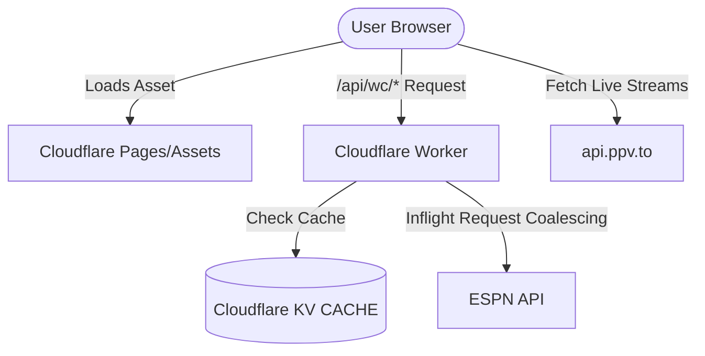

# Repository Guidelines

## Project Overview
StreamCup is a high-performance, lightweight web application for tracking the FIFA World Cup 2026 schedule, standings, statistics, and live streams. It consists of a React-based Single Page Application (SPA) on the frontend and a Cloudflare Workers proxy on the backend to cache and coalesce ESPN API requests.

## Architecture & Data Flow

- **Frontend SPA**: React 18 application built with Vite. It features a hand-rolled History API router (`src/utils/router.ts`) and custom hooks for data fetching, caching, and background polling.
- **Backend Edge Proxy**: Cloudflare Worker (`worker/index.ts`) serving requests under `/api/wc/*`. It proxies the ESPN API, validates event parameters to prevent SSRF/injection, caches raw data in Cloudflare KV using a Stale-While-Revalidate (SWR) strategy, and coalesces concurrent requests in memory to minimize upstream pressure.
- **Data Fetching Flow**: Hooks like `useWorldCup` fetch data from the Worker. A SWR caching strategy in memory (`cacheRef`) ensures instant render on view transitions, combined with page-visibility-aware background polling (every 30s for matches, 60s for streams).

## Key Directories
- `src/components/`: Modular React components. Segmented into subfolders like `matchdetail/` for tabbed subviews.
- `src/hooks/`: Data hooks (`useWorldCup`, `useMatchDetail`, `useStreams`, `useFavorites`, `useBracket`) containing polling, caching, and cleanup logic.
- `src/utils/`: Pure utilities (e.g., `espn.ts` for parsing raw ESPN boxscores/commentary/lineups and computing 2D field coordinates; `router.ts` for History API routing; `calendar.ts` for `.ics` and Google Calendar reminders).
- `worker/`: Cloudflare Worker entrypoint and its corresponding unit tests.
- `docs/`: Superpower spec documents and development implementation plans.

## Development Commands
- `bun run dev`: Start local Vite development server on port 5173 (with local API proxy rules).
- `bun run build`: Compile TypeScript and build the static assets via Vite.
- `bun run test`: Run the Vitest test suite.
- `bun run typecheck`: Run TypeScript compilation check for both React app and Worker code.
- `bun run lint`: Run Biome linter on the codebase.
- `bun run format`: Run Biome formatter auto-write on the codebase.

## Code Conventions & Common Patterns
- **Rounded Glassmorphism Design**: Layout panels, cards, and modal components use standard Tailwind rounded utilities (`rounded-2xl`, `rounded-3xl`, `rounded-full`) and backdrop blur (`backdrop-blur-md`, `bg-panel/85 border border-line/30`) matching Apple Sports style.
- **Capsule Controls**: Tab lists, page navigation, and team selectors must use capsule-shaped Segmented Controls (`rounded-full p-1 bg-panel/60 border border-line/20`).
- **Async Safety**: Every async fetch inside an effect hook MUST bind and listen to an `AbortSignal` via `AbortController` to cancel pending fetches on component unmount or state re-fetch.
- **State Management**: Zero Redux/Zustand dependency. State is local, passed down, or managed using simple React Context (e.g., `LanguageProvider` for i18n). Collections like favorites are synchronized across tabs using the `storage` event listener on `localStorage`.
- **Naming Conventions**: Components and React files use PascalCase (e.g. `MatchCard.tsx`). Hook files use camelCase starting with `use` (e.g. `useWorldCup.ts`). Pure utils and files use camelCase (e.g. `espn.ts`).
- **Native Elements**: Prefer native HTML components where possible (e.g., using `
` and `
` for dropdown reminder menus).

## Important Files
- `src/main.tsx`: Front-end entrypoint and service worker registration.
- `src/App.tsx`: Root component and main router distribution hub.
- `src/utils/router.ts`: Hand-rolled History API router and path definition.
- `worker/index.ts`: Edge Worker entrypoint executing KV caching, SWR, and request coalescing.
- `src/utils/espn.ts`: Pure ESPN summary parser and 2D player tactical pitch coordinate generator.
- `public/sw.js`: Service worker implementing cache-first for hashed assets and network-first for index.html to guarantee cache consistency across updates.

## Runtime/Tooling Preferences
- **Runtime**: **Bun** is the preferred local environment (lockfile: `bun.lock`).
- **Package Manager**: **Bun** (`bun install`, `bun test`, `bun run`).
- **Tooling Constraints**: **Biome** (v2.5.1) handles linting and formatting. Do not use Prettier or ESLint. Code styling conforms strictly to `biome.json` formatting settings.

## Testing & QA
- **Framework**: **Vitest** (v1.6.1) is the test runner.
- **Testing Environments**:
  - Frontend components (`src/**/*.test.tsx`, `src/**/*.test.ts`) run in a **JSDOM** browser environment.
  - Worker tests (`worker/**/*.test.ts`) run in a **Node** environment via `// @vitest-environment node` header comments.
- **Mocking Patterns**:
  - Global `fetch` is mocked by overwriting `globalThis.fetch = vi.fn()`.
  - Worker tests mock the environment using local `Map` instances to simulate Cloudflare KV `CACHE.get`/`CACHE.put` and mock `ctx.waitUntil`.
  - Hooks are tested using React Testing Library's `renderHook` or via a custom `<Harness>` component to capture hook output without full render.
